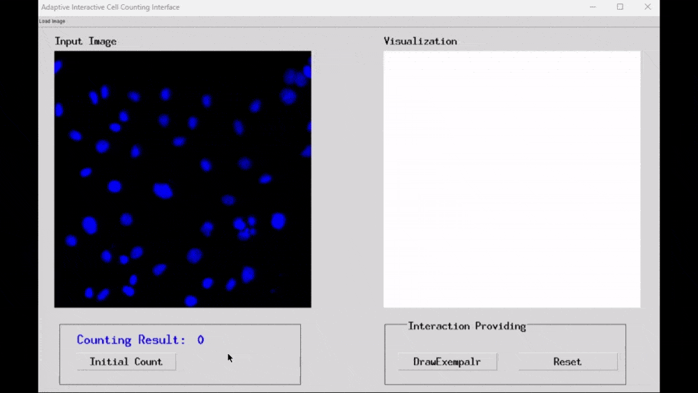

## Interactive Fluorescence Cell Counting via User-Guided Correction

*We introduce the Adaptive Interactive Cell Counting (AICC) framework, combining a coordinate-based prediction module with user-guided correction.*



[Paper]

## NSC-34 EdU Fluorescence Cell Dataset (NEFCell) and Checkpoints

Get NEFCel and Checkpoints from https://drive.google.com/drive/folders/1vFn8KNNYYFpLjFZXTxO5qAMS4ar64XJJ?usp=sharing

The Data folder should be organized as follows:
- 📂 **Data**
  - 📂 **NEFCell**
    - 📂 **DATA_ROOT**
      - 📂 **train**
        - 📂 **train_file**
        - 📂 **images**
        - 📂 **ground_truth**
      - 📂 **testval**
      - 📂 **test**

The Checkpoints folder should be organized as follows:
- 📂 **Checkpoints**
  - 📂 **e1500**
    - 📄 NEFCell_p2p_best_e1500.pth
  - 📂 **e20**
    - 📄 NEFCell_p2p_best_e20.pth

## Environment set up
```
conda create -n AICC python=3.8.8
conda activate AICC
pip install numpy==1.24.4 opencv-python==4.5.4.60 matplotlib==3.3.4 scipy==1.10.1 scikit-learn==1.4.1.post1 pillow==10.3.0
pip install torch==1.12.1+cu116 torchvision==0.13.1+cu116 torchaudio==0.12.1+cu116 --extra-index-url https://download.pytorch.org/whl/cu116
pip install tqdm
pip install easydict
pip install omegaconf
pip install pyyaml
pip install requests
```
